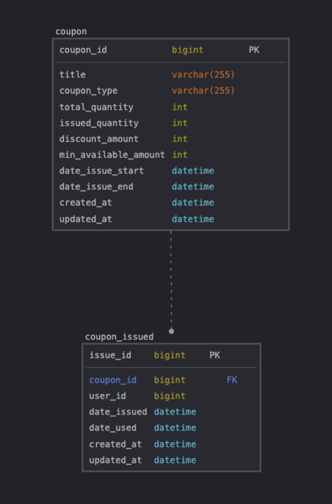
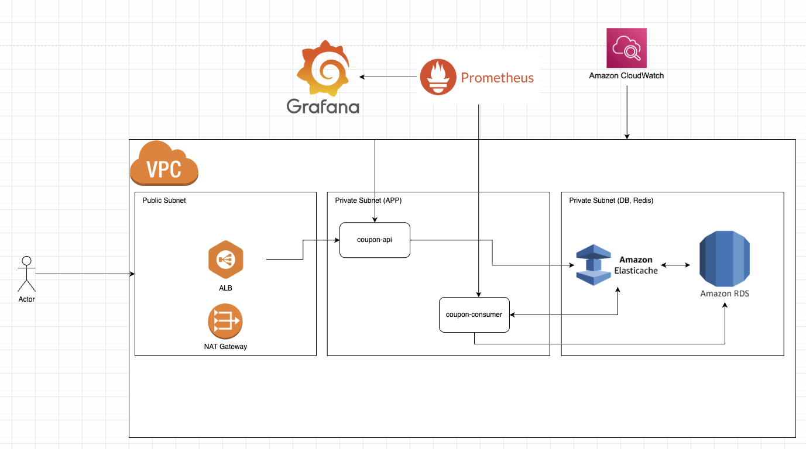

# PJ3. 선착순 쿠폰 이벤트 서비스

선착순 쿠폰 이벤트와 같은 스파이크 성 트래픽 부하를 견딜 수 있는 아키텍처 고민 및 구현 프로젝트 By.최치원

---

## 📌 프로젝트 목적

- 선착순 쿠폰 이벤트와 같은 스파이크 성 트래픽을 무사히 처리하기 위한 설계 공부
- 쿠폰 이벤트 시 발생할 수 있는 동시성 문제를 이해하고 동시성 문제를 해결하기
  - 분산 락 + DB 제약 + 애플리케이션 락을 적절히 활용
- 사용자가 짧은 시간 급격히 몰리는 경우에 대한 성능 테스트를 진행해보고 현재 구현된 구조에서
  어떤 문제가 있는지, 이 문제를 어떻게 해결하고 어떤 새로운 설계를 하면 좋을지 고민

---

## 🧰 기술 스택

| 항목     | 내용                                                                                                                                |
|--------|-----------------------------------------------------------------------------------------------------------------------------------|
| 언어     | Java 21                                                                                                                           |
| 빌드 도구  | Gradle                                                                                                                            |
| 개발     | Spring Boot 3.4.4, Spring Data JPA 3.4.4, QueryDsl 5.1.0, Redisson 3.37.0, EmbeddedRedis 1.4.3, Docker (MySQL, Redis, Locust 개발용) |
| 데이터    | MySQL 8.0.38 (RDS), Redis (ElastiCache)                                                                                           |
| 성능 테스트 | Python Locust                                                                                                                     |
| 배포     | AWS                                                                                                                               |
| 모니터링   | Grafana, Prometheus, CloudWatch                                                                                                   |

---

## 📈 주요 기능

| 컴포넌트    | 기능 항목                   | 상태 |
|---------|-------------------------|----|
| **쿠폰**  | 쿠폰 생성                   | ✅  |
|         | 쿠폰 발급                   | ✅  |
|         | 쿠폰 검증                   | ✅  |

## 🗼 ERD

---

## 🏛️ Architecture

